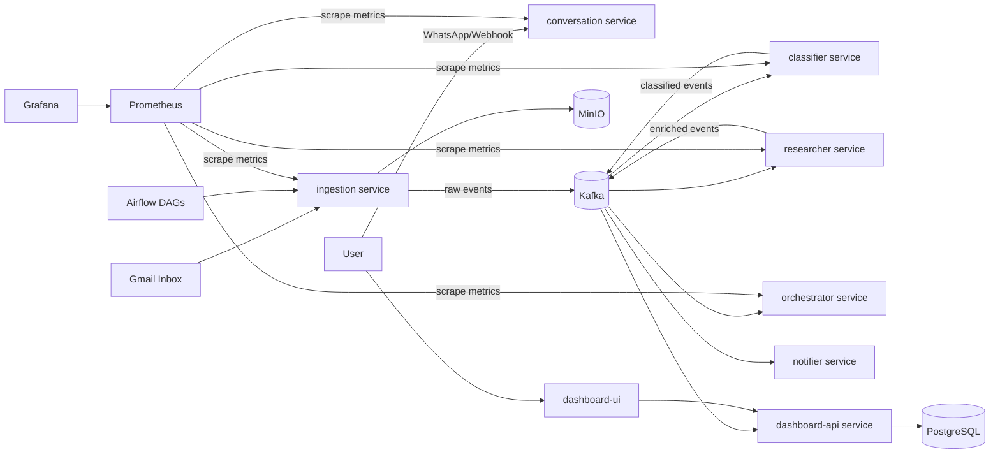
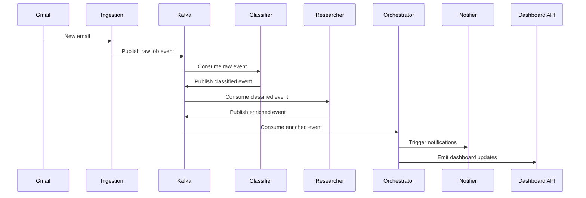

# JTC AI Job Orchestrator

Event-driven microservices platform that ingests job-related emails, classifies career events with LLMs, enriches records with research context, and exposes real-time operations through dashboards.

## What It Does

- Ingests emails from configured inbox sources
- Classifies events: interview, offer, rejection, other
- Runs downstream research and enrichment
- Publishes orchestrated events for consumers
- Tracks system health with Prometheus and Grafana

## Architecture

Core components:
- Messaging: Kafka and Zookeeper
- Storage: PostgreSQL and MinIO
- Orchestration: Airflow
- Services: ingestion, classifier, researcher, notifier, orchestrator, conversation, dashboard-api, dashboard-ui
- Observability: Prometheus and Grafana

Deployment entrypoint:
- deploy/docker-compose.yml

### System Architecture Diagram



### Event Flow Diagram



## Repository Layout

- services: service-specific applications
- libs/core: shared config, clients, and utilities
- deploy: compose stack, dags, scripts, monitoring config
- docs: architecture and implementation references

## Quick Start

### Prerequisites

- Docker and Docker Compose
- Python 3.11+ (for local scripts)

### 1. Configure Environment

```bash
cp deploy/.env.example deploy/.env
```

Populate required values in deploy/.env:
- POSTGRES_PASSWORD
- MINIO_ROOT_PASSWORD
- GOOGLE_API_KEY
- GROQ_API_KEY
- OPENAI_API_KEY
- TAVILY_API_KEY
- WHATSAPP_API_TOKEN

### 2. Start Infrastructure

```bash
cd deploy
docker compose up -d zookeeper kafka postgres minio
```

### 3. Initialize Topics

```bash
python scripts/init_kafka_topics.py
```

### 4. Start All Services

```bash
docker compose up -d
```

### 5. Verify Services

```bash
docker compose ps
curl -N http://localhost:8005/events
curl http://localhost:8004/health
```

## Dashboards

- Grafana: http://localhost:3001
- Prometheus: http://localhost:9091
- Airflow: http://localhost:8080
- Dashboard UI: http://localhost:3030
- Dashboard API: http://localhost:8000

## Testing

### Test Metrics Endpoints

```bash
curl http://localhost:8004/metrics | grep conversation_
curl http://localhost:8005/metrics | grep orchestrator_
```

### Test Event Injection

```bash
# from repository root
python inject_test_event.py
```

### Test Daily Stats Job

```bash
python deploy/scripts/daily_stats_job.py
```

## Operations

```bash
# from deploy directory
docker compose logs -f
docker compose logs -f classifier
docker compose restart orchestrator
docker compose down
```

## Security

- Secrets are environment-injected (not hardcoded in compose values).
- Local credential artifacts are excluded from Git via .gitignore.
- Secret scanning is configured with gitleaks and pre-commit.

Enable local pre-commit checks:

```bash
pip install pre-commit
pre-commit install
pre-commit run --all-files
```

## Documentation

- docs/architecture-diagram.md
- docs/implementation_plan.md
- docs/PROJECT_STATUS.md

## License

Add a LICENSE file before public distribution.
